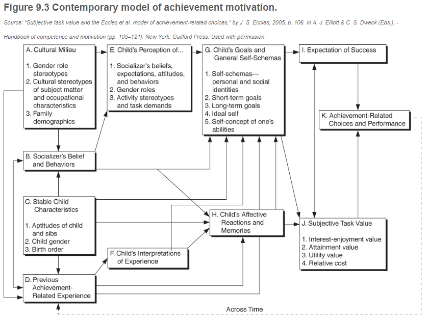

## Background

While the antecedents of modern motivation theory are many, there's three perspectives which are relevant to learning: drive theory, conditioning theory, and cognitive consistency theory.
- Drive Theory: Drives were defined by Woodworth (1918) as "internal forces that sought ot maintain homeostatic body balance" (Motivation, "Background and Assumptions", Drive Theory, para. 1). Later, Hull (1934) suggests that "physiological deficits...instigated drives to reduce needs" (para. 3). Thus, motivation became the result of learned behaviors in order to seek to satisfy needs. 

- Conditioning Theory: Building off of the conditioning theories of Skinner, conditioning theory situates "motivation in terms of responses elicited by stimuli (classical conditioning) or emitted in the presence of stimuli (operant conditioning) (Conditioning Theory, para. 1). In this way, motivated behaviors are simple consequences of a conditioning process.

- Cognitive Consistency Theory: This theory posits that motivation is a consequence of both cognition and behavior. It "predicts that when tension occurs among elements, the problem needs to be resolved by making cognitions and behaviors consistent with one another" (Cognitive Consistency Theory, para. 1). As a subset, balance theory suggests that "individuals have a tendency to cognitively balance relations among persons, situations, and events" (para. 2). A related theory is cognitive dissonance, formulated by Festinger (1957): "indidivuals attempt to maintain consistent relations among their beliefs, attitudes, opinions, and behaviors" (para. 6): it is said that two cognitions are **consonant** if one is a consequence or related to the other; **irrelevant** if they are unrelated; **dissonant** when one opposes the other. Dissonance creates a situation of unbalance, and can be reduced in a handfule of ways: changing discrepancies; naming/justifying cognitions; downgrading importance of cognitions; altering behavior (para. 8)

- Humanistic Theories: These are primarily constructivist in nature, "emphasize cognitive and affective processes", and "address people's capabilities and potentialities as they make choices and seek control over their lives" (Humanistic Theories, para. 1). In particular, humanists posit that "to understand people, we must study behaviors, thoughts, and feelings" and "emphasize individuals' self-awareness", which directly contrasts with behaviorist approaches (para. 2). They also believe that "human choices, creativity, and self-actualization" are important for study (para. 3). An important humanistic theory is Maslow's Hierarchy of Needs (1968, 1970) (Physiological -> Safety -> Belongingness -> Esteem -> Self-actualization). The first four are called 'deprivation needs', that is "their lack of satisfaction produces deficiencies that motivate people to satisfy them" (para. 7). Self-actualization ("desire for self-fulfillment") can manifest in many ways, but is "not motivateed by a deficiency but rather by a desire for personal growth" (para. 7). Another is the idea of **actualizing tendency**: "an ongoing process of personal growth or achieving wholeness" (para. 16). As people develop, they become more self-aware; that awareness becomes elaborated through interactions with someone's environment. Self-awareness development creates a need for **positive regard** ("feelings such as respect, liking, warmth, sympathy, and acceptance"), and specifically **positive self-regard** ("postive regardthat derives from self-experiences") (para. 17-18). **Conditional regard**, "regard contingent on certain actions", produces tension "because people feel accepted and valued only when they behave appropriately" (para. 19).

## Achievement Motivation

Achievement motivation is a term that "refers to striving to be competent in effortful activities (Elliot & Church, 1997)" ("Achievement Motivation", para. 1). Historically, there are roots in the theories of Atkinson which posit that "behavior depends on one's expectancy of attaining a particular outcome (e.g., goal, reinforcer) as a result of performing given behaviors and on how much one values that outcome" (Expectancy-Value Theory, para. 1). Fundamentally, "an attractive outcome, coupled with the belief that it is attainable, motivates people to act" (para. 1). For Atkinson, the tension between hope for success and avoidance is what drove achievement behaviors; to that end, he postulated that the tendency to approach an achievement-related goal was directly proportional to motive to succeed, subjective probability of success,a nd incentive value of success. Similarly, the tendency to avoid failure is directly proportional to the motivation to avoid failure, the probability of failure, and the inverse of the incentive value of failure. In that way, the resultant achievement motivation would be the difference between the tendency to approach an achievement-related goal and the tendency to avoid failure. Accordingly, "this model predicts that students high in resultant achievement motivation will choose tasks of intermediate difficulty" because they "believe they are attainable and will produce a sense of accomplishment" (para. 7). Experimentation has resulted in mixed results, however; research suggests that actors don't necessarily follow the model and it could be concluded that "people choose to work on easy or difficult tasks for many reasons, and Atkinson's theory may have overestimated the strength of the achievement motive" (para. 9). 

Contemporary view on achievement motivation value subjectivity along with emphasis on cognitive considerations on motivation. Indeed, "current models also place greater emphasis on contextual influences on achievement motivation, realizing that people alter their motivation depending on perceptions of their current situations" (Contemporary Model of Achievement Motivation, para. 2). One model proposed by Eccles (2005) illustrates the interconnectedness of many variables.

According to the model, the value ("perceived importance of the task, or belief about why one should engage in the task") depends on four components: attainment value ("importance of doing well on the task"); intrinsic/interest value ("inherent, immediate enjoyment" of the task); utility value (importance of the task "relative to a future goal"); and cost belief ("perceived negative aspects of engaging in the task (Wigfield et al. 2016)) (para. 5-6).

Expectancy is a second component of the model, and "refers to individuals' perceptions concerning the likelihood of success on tasks" (para. 7). Goals and self-schemas, affective reactions and memories, perception of sociocultural environment, and learner characteristics/expectations also comprise the model.

Perhaps unsurprisingly, domestic and family factors have large sway over achievement motivation. A study by Rosen & D'Andrade (1959) found that "parental pressure to perform well is a more important influence on achievement motivation than parental desire for child independence" (Family Influences, para. 1). Other studies show that parental involvement is positively correlated with achievement motivation, and security of attachment is negatively correlated with tendencies of perfectionism (para. 2). 

Piggybacking from Atkinson's theories is the idea of self-worth. Self-worth theory "[combines] emotions with cognitions" (Self-Worth Theory, para. 2). The core assumption is that an individual places value on success over failure, which should be avoided due to implication about the individual's ability. In this way, "self-worth theory stresses perceptions of ability as the primary influences on motivation", though experiments suggest that the ability is a primary concern in Western cultures while some Asian cultures prize effort more highly (para. 6). 

## Attributions

Attribution theory explains how "perceived causes of outcome" influence behavior ("Attributions", para. 1). Two foundational concepts are **locus of control** and **naive analysis of action**. 

Rotter (1966) termed the locus of the control as a "generalized expectancy concerning whether responses influence the attainment of outcomes"; these can be internally situated or externally situated (Locus of Control, para. 1). Generally, the expectancy beliefs that stem from the locus of control "are hypothesized to affect behavior" and reflect the outcome expectations of the student (para. 3-4). Naive analysis of action was the name that Heider (1958) gave to attribution theory. In it, he "postulated that people attribute causes to internal or external factors", referred to as effective personal force and effective environmental force (Naive Analysis of Action, para. 1-2). For him, "the personal force is allocated to two factors", power ("abilities and motivation to intention and exertion") and motivation (para. 3).

Weiner and colleagues "provided the empirical base for developing an attribution theory of achievement" (Attribution Theory of Achievement, para. 1). Causal factors (ability, effort, task ease/difficulty, luck, etc.) can be incorporated, as well as causal dimension (internal/external, stable/unstable). Laying these out in a coordinate plane gives different combinations; for example, "ability is internal and relatively stable", while "[typical] effort is internal but unstable" (para. 4). The coordinate pair can then be classified as controllable or uncontrollable (e.g. typical effort and ability are both stable/internal, but typical effort is controllable while ability is not). Stability "is thought to influence expectancy of success"; locus "is hypothesized to influence affective reactions"; controllability "has diverse effects" (para. 7-9).

## Social Cognitive Processes

Learning is strongly motivated by setting goals and evaluating one's progress toward those goals. Several processes involved are isolated as important: goals and expectations, social comparison, and self-concept.
- Goals and Expectations: These are "strong motivators of learning" ("Social Cognitive Processes", Goals and Expectations, para. 1). Gaps between expectation and reality are what drive desire to change, and help motivate goal-setting (and evaluation). 

- Social comparison: This is "the process of comparing ourselves with others" (Social Comparison, para. 1). Festinger's (1954) research suggests that "the most accurate self-evaluations derive from comparisons with those similar in the ability or characteristic being evaluated" (para. 1). In doing this, however, developmental status is important; the research seemed to falter with children around age 5 or 6, and intuitively makes sense with similar-style gaps.

- Self-concept: this "refers to one's collective self perceptions (a) formed through experiences with, and interpretations of, the environment and (b) heavily influence by reinforcements and evaluations by significant other persons (Shavelson & Bolus, 1982)" (Self-Concept, para. 1). Other constructs like self-esteem and self-confidence exist within this umbrella. Two others are self-concept stability ("the ease or difficulty of changing the self-concept") and self-crystallization (solidification of self-concept) (para. 2). Self-concept "is not passibely formed but is rather a dynamic structure that mediates significant intrapersonal and interpersonal processes (Cantor & Kihlstrom, 1987)" (para. 6). 

## Goal Orientations

Goal orientations "are learners' reasons for engaging in academic tasks" and form a key component of goal theory, which "postulates that important relations exist among goals and goal orientations, expectations, attributions, conceptions of ability, social and self-comparisons, and acheivement behaviors (Anderman & Wolters, 2006; Elliot, 2005; Maehr & Zusho, 2009; Meece, Anderman & Anderman, 2006; Senko, 2016)" ("Goal Orientations", para. 1).  There are several kinds of goal orientations, split out by learning goal or performance goal. Learning goals include mastery, task-involved, and task-focused goals; performance goals can be ego-involved or ability-focused. 

Having a learning goal orientation "focuses students'a ttention on processes and strategies that help them acquire capabilities and improve their skills (Ames, 1992a)" (Types of Goal Orientations, para. 3). This in turn boosts self-efficacy, self-regulation, progress, and ultimately achievement gains. Learning goal orientation is also heavily associated with a growth mindset perspective.

A performance goal orientation "focuses attention on completing tasks (Linnenbrink-Garcia  et al., 2012; Figure 9.4b)" (para. 4). These can interact with social comparison, as well as with learning goal orientations. Schunk cites several studies to describe interactions of learning goal and performance goal orientations:
- Meece, Blumenfeld, and Hoyle (1988): Intrinsic motivation is positively correlated to setting goals focused on learning and understanding (para. 5)
- Elliot and Dweck (1988): Learning-goal students chose challenging tasks and engaged in problem solving, while performance-goal students avoided challenging tasks and their persistence was contingent on whether or not feedback addressed a strong or low ability.
- Schunk and Rice (1989): having a process goal results in higher self-efficacy than a generic one
- Schunk and Rice (1991): combining process goals with feedback boosts self-efficacy and skill
- Schunk and Swartz (1993a, 1993b): confirms that process goals with feedback is highly effective at improving achievement

Overall, "evidence demonstrates that a learning-goal orientation facilitates achievement motivation, beliefs, and skill acquisition better than a performance-goal orientation" (para. 15). 

## Intrinsic Motivation

Intrinsic motivation is defined to be "desire to engage in an activity for no obvious reward except task engagement itself (Lepper, Corpus, & Iyengar, 2005)" ("Intrinsic Motivation", para. 1). This is naturally contrasted with external motivation. Early thoughts on intrinsic motivation supposed an "intrinsic need to deal with the environment" ("Early Views", para 2, as cited in White (1959) pp. 317-318). This suggests a mostly biological approach, which is modified by Harter (1978, 1981) in the developent of mastery motivation. In it, Harter emphasizes both success and failure as well as social considerations for how children come to their motivational stances. 

When taking cognition into account, "cognitive conceptions of intrinsic motivation uniformly predicted that perceived control over task engagement and outcomes is a critical incluence (Schunk & Zimmerman, 2006)" ("Perceived Control", para. 1). Ultimately, perceived control (or agency) is critical to both self-efficacy and outcome expectations. Three types are identified by Skinner, Wellborn, and Connell (1990): strategy beliefs ("expectations about factors that influence success"); capacity beliefs ("personal capabilities with respect to ability, effors, others, and luck"); and control beliefs ("expectations about one's chances of doing well in school without refernce to specific means") (para. 3). Motivation is also impacted by learned helplessness, which has a plethora of implications for motivation, self-efficacy, and types and duration of tasks attempted.

Some constructs that address self-motivation are growth-mindset perspectives and self-determination theory. Self-determination theory "postulates that intrinsic motivation is influenced by three basic innate psychological needs: competence, autonomy, and relatedness (Ryan & Deci, 2016)" ("Self-Determination", para. 2). Competence refers to the ability to engage with one's environment (social, cultural, physical, etc.); autonomy refers to "a sense of control or agency in interactions in the environment (Ryan & Deci, 2000)"; relatedness "refers to the need to belong to a group" (para. 2). Under SDT, intrinsic motivation is a corollary to these needs and "emphasizes the internalization of social values and mores" (para. 4). 

Related to intrinsic motivation is the theory of flow by Csikszentmihalyi (1975). Flow is a state in which one may get lost in their activity, and are immersed totally in concentrating psychic effort toward the activity. Lepper and Hodell (1989) propose four sources for intrinsic motivation: challenge, curiosity, control, and fantasy. Interspersed in all of this is incorporation of rewards, internal and external. The expectation is that internal rewards result in longer-lasting interest and motivation, while external ones conclude in shorter-term results.

---
### Citations

Schunk, D.H. (2019). Learning theories: An educational perspective (8th ed.). Pearson.

